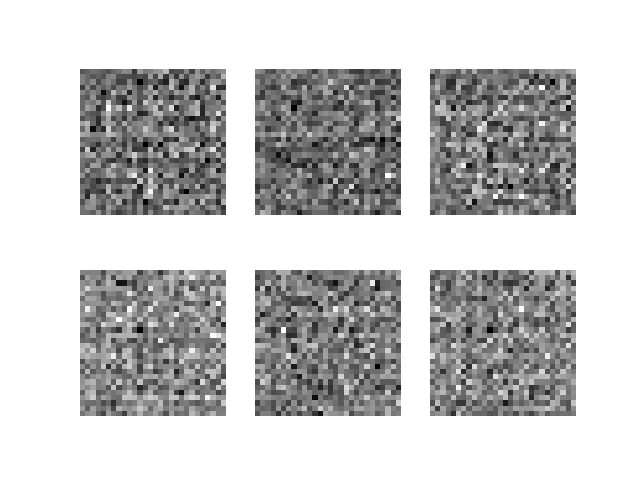
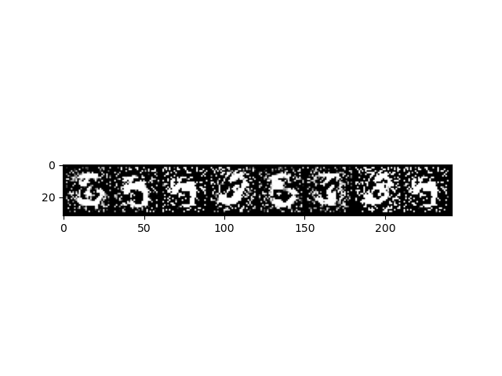

# MNIST-GAN
 Generative Adversarial Networks trained on the MNIST dataset


## Setup

```bash
conda create -n mnist-gan python==3.11
conda activate mnist-gan
pip install -r requirements.txt
python -m mnist_gan main
```

You can view the training progress by running `tensorboard --logdir=.` and navigating to `localhost:6006` in your browser.

You can also plot a sample of generated images of the most recent epoch by running:

```bash
python -m mnist_gan plot-checkpoint
```

## Example Output

Epoch 0:



Epoch 100:



## Explanation

In a Generative Adversarial Network (GAN), the generator and discriminator are two neural networks that are trained simultaneously through adversarial training. Their roles are distinct but complementary in the GAN framework:

### Generator:

Purpose: The generator's primary role is to generate synthetic data that resembles the real data.
Architecture: It takes random noise as input and transforms it into data samples that should be indistinguishable from real data by the discriminator.
Training Objective: The generator aims to produce data that is difficult for the discriminator to distinguish from real data. Its objective is to minimize the discriminator's ability to differentiate between real and generated samples.


### Discriminator:

Purpose: The discriminator's primary role is to distinguish between real and generated data.
Architecture: It takes both real and generated data as input and outputs a probability indicating the likelihood that the input data is real.
Training Objective: The discriminator is trained to correctly classify real and generated samples. Its objective is to maximize the ability to differentiate between real and generated data. At the same time, it provides feedback to the generator to improve its ability to generate realistic data.


During training, the generator and discriminator are engaged in a continuous feedback loop:

1. The generator creates synthetic data.
2. The discriminator evaluates both real and generated data and provides feedback.
3. The generator adjusts its parameters to produce more realistic data based on the discriminator's feedback.
4. The discriminator adapts to the evolving capabilities of the generator.

This adversarial process continues iteratively until the generator produces data that is difficult for the discriminator to distinguish from real data, resulting in a well-trained GAN. The equilibrium reached in this process ideally leads to the generation of high-quality synthetic data that closely matches the distribution of the real data.
